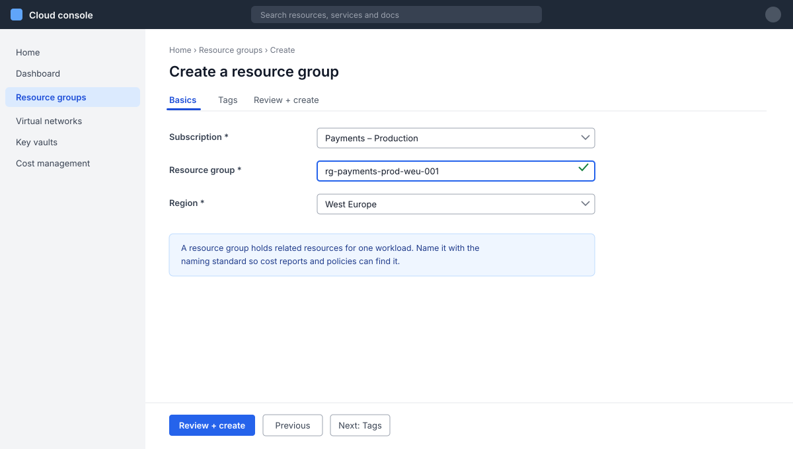

# Screenshots

A framed screenshot with a caption. Click any image on the site to see it full size.

## Screenshots

=== "Preview"

    <figure class="screenshot" markdown="span">
      
      <figcaption>The name is checked as you type. A green tick means it's free.</figcaption>
    </figure>

=== "Markdown"

    ``` markdown
    <figure class="screenshot" markdown="span">
      
      <figcaption>The name is checked as you type. A green tick means it's free.</figcaption>
    </figure>
    ```

The frame keeps a white screenshot from running into a light page, and in dark themes the image is dimmed a little until you point at it. The alt text in the square brackets says what the screenshot shows; the caption says what to notice.

A plain image, without the `<figure>`, gets click-to-zoom too. To turn that off for one image, such as a small icon, add `{ .off-glb }` after it.

## Taking good screenshots

- **Instructions go in the text.** A screenshot confirms the reader is in the right place; it shouldn't be the only place a step is written down. Write the step with a [UI path](ui-paths.md) and add the screenshot beside it.
- **Crop to what matters.** The form or panel the step is about, not the whole browser window. About 1200 to 1600 pixels wide.
- **Hide what's private.** Blur or replace subscription and account IDs, tenant names, email addresses, IP addresses and anything from a real customer before you save the file.
- **Use a light console theme** and the browser at 100% zoom, so all screenshots on the site match.
- **Mark the spot** with a plain rectangle in the image editor when the thing to click is small. One mark per screenshot.
- **Save them in `docs/images/`**, with a name that says what they show, like `portal-create-resource-group.png`.

Consoles change their layout often, and an out-of-date screenshot confuses more than none at all. When you review a page with screenshots, retake any that no longer match, and update the [review date](page-details.md).
